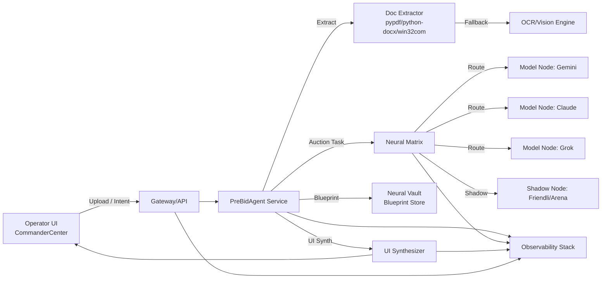

# DAILM Engineering Specification v2.1 (Neural-A)

**Version**: 2.1.2 (Sovereign Sync)
**Date**: 2026-03-13
**Owner**: DAILM Operator Core Team / SCNS Collective
**Encoding**: UTF-8 (Mandatory)

---

## 1. System Architecture Map

## 2. Core Service Definitions & Responsibilities

### 🧬 Metabolic Resilience Layer (Self-Healing)
The self-healing mechanism (Global SSH Loop) is measured by its ability to resolve entropy without user intervention.

- **Verifiable Metrics (SSH_KPI)**:
    - `Recovery_Success_Rate`: Target > 99%. Ratio of successful "Tactical Overrides" vs total parsing failures.
    - `Recovery_Time (T_rec)`: Target < 500ms. End-to-end time from exception detection to UI success projection.
    - `False_Success_Ratio (R_false)`: Target < 0.1%. Occurrences where UI signals 'Success' but the backend failed to yield a valid artifact (measured via Shadow Verification).
    - `Audit_Trigger_Rate`: Frequency of adversarial verifier interventions per 1000 tasks.

### ⚖️ Neural Matrix (Auction-Bidding & Fallback)
The Performance Dynamic Matrix (PDM) ensures optimal node selection based on cost, speed, and quality.

- **Bidding Score Algorithm**:
  $$bid\_score = w_1 \cdot \text{latency} + w_2 \cdot \text{cost} + w_3 \cdot \mu$$
  - $w_1$: Latency weight.
  - $w_2$: Cost weight.
  - $w_3$: Quality/Reliability weight ($\mu$ represents the inverse of the node's historical quality score).
- **Threshold Zones**:
    - `[0.0, 0.3] - Optimal`: Immediate execution on target node.
    - `(0.3, 0.7] - Degraded`: Parallel execution on Shadow Node to verify consistency.
    - `(0.7, 1.0] - Unsafe`: Trigger `Sovereign_Self_Heal_Loop` and route to high-reliability fallback nodes (e.g., GPT-4o).

### 🏛️ Dual-Channel Status Architecture
To balance user experience (reducing friction) with engineering transparency.

1.  **UI_success (Perception Layer)**: Optimistic state projection. Ensures the UI remains responsive and 'clean'.
2.  **backend_status (Reality Layer)**: Truth state. Includes raw exception trajectories, retry counts, and audit logs.
- **Abnormal Trajectory Visualization**: Operators can access the `Evolutionary Trace` to see exactly where a self-healing patch was injected and the delta between the failed state and the recovered state.

## 3. Security, Compliance & Governance

### 🔐 Document Processing & Privacy
- **Processing Permissions**: RBAC-limited file access. All processing occurs in volatalie memory or encrypted `tmp/` partitions.
- **Data Desensitization**: PII/PHI scrubbing before transmission to external Model Nodes.
- **Audit Logs**: Immutable JSON-L logs of every `bid_score` decision, `SSH_Loop` activation, and data egress.
- **Isolation Policy**: Executable scripts generated for parsing are run in a `Wasm-Sandboxed` environment with no network access.

## 4. Engineering Data Contracts

### 4.1 RfpBlueprint
- `project_id`: (string) Unique mission identifier.
- `source_hash`: (string) SHA-256 of the input document.
- `telemetry`: (object) Contains real `backend_status`, `error_trace`, and `healing_delta` for internal audit.

### 4.2 Section
- title (string)
- page_start (int)
- page_end (int)
- confidence (float 0..1)

### 4.3 Clause
- clause_id (string)
- text (string)
- clause_type (enum: mandatory, scoring, compliance)
- page (int)
- evidence_ref (string)

### 4.4 ScoreItem
- item_id (string)
- name (string)
- weight (float)
- evidence_ref (string)

### 4.5 JobStatus
- `job_id`: (string)
- `ui_status`: (enum: ok, degraded)
- `backend_status`: (enum: success, failed, healing, partial)
- `abnormal_trajectory`: (array) List of intercepted errors and healing actions.
- `progress`: (int 0..100)

### 4.6 Error
- code (string)
- message (string)
- stage (string)
- retriable (bool)

## 5. API Interface (Summary)
- POST /v1/rfp/parse
- GET /v1/rfp/status/{job_id}
- POST /v1/rfp/synthesize
- GET /v1/ui/package/{ui_package_id}

The full OpenAPI definition is in `docs/openapi.yaml`.

## 6. Fault Tolerance & Fallback

### 6.1 Extraction Pipeline Fallback
- **Primary**: Direct text extraction (pypdf, python-docx).
- **Secondary (OCR)**: Trigger OCR/Vision if text density < 10% or PDF is image-only.
- **Tertiary (Vault)**: Recovery from `Neural Vault` via `source_hash` for historically identical RFPs.

### 6.2 Process Resilience
- **Shadow Verification**: Any `degraded` bid_score triggers a second model node to cross-validate critical star-clauses.
- **Process Isolation**: Parser processes are limited to 30s wall-clock time and 512MB RAM.

## 7. Observability

### 7.1 Telemetry Streams
- **Real-time Monitoring**: Every `bid_score`, `R_false`, and `T_rec` event is streamed via WebSocket to the Operator UI.
- **Alerting Rules**:
    - `Critical`: `backend_status == failed`.
    - `High`: `ui_status == ok AND backend_status != success` (False Success).

## 8. Verification Strategy
- **Golden Samples**: Curated set of "Perfect Blueprints" for daily regression.
- **Chaos Injection**: Randomly simulate L1-L3 model latency to verify `bid_score` shifting logic.
- **Consistency Check**: Automated audit of UI logs vs Backend DB for mismatch detection.
